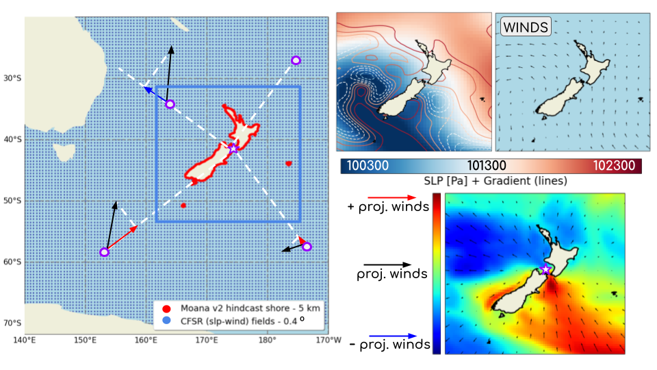

# This repository contains the data used in the MBIE funded smart ideas research project.

The content of the different folders is the following:
---------------------------------------------------

- **storm_surge_data**: All the data containing storm surge or similar (twl, tide...)
- **cfsr**: Numerical data of CFSR reanalysis
- **era_5**: Numerical data of ERA5 reanalysis
- **statistics**: Some pre-calculated statistics for the different models used and experiments FINAL results
- **calculated_pcs**: Some pre-calculated pcs for the different predictors used can be loaded from here

Below, the aspect of the data used can be seen:

but also data domains and plotted data:

